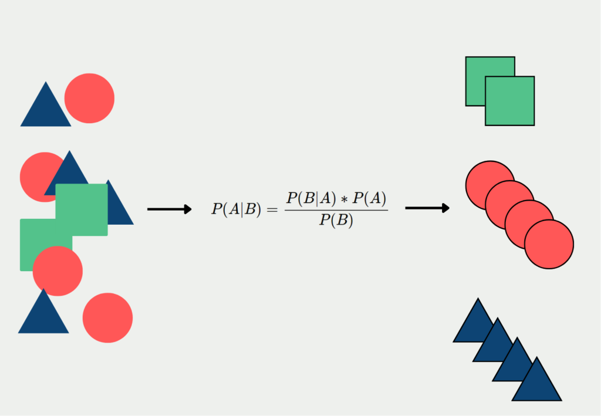

Descrição:

Este projeto consiste em um sistema simples de inteligência artificial criado para entender a ferramenta, visando seu uso futuro em outros sistemas propostos. O objetivo dessa IA é analisar palavras e diferenciar entre positivo e negativo. Se essa função for aprimorada, poderá gerar sistemas mais eficientes para capturar conversas complexas.

Tipo de IA:
Aprendizado de Máquina Supervisionado

Naive Bayes

exemplo:
O algoritmo Naive Bayes é um método de classificação probabilístico baseado no Teorema de Bayes, que é uma fórmula matemática que descreve como atualizar probabilidades quando novas evidências são observadas. Esse algoritmo é especialmente utilizado para classificar dados em categorias

Tal foi escolhido devido a sua baixa complexidade 